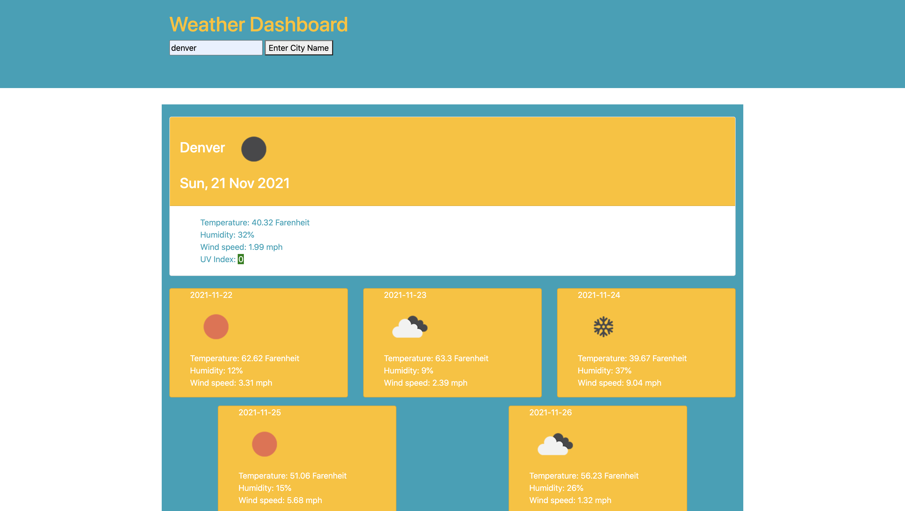

<h1> Weather Dashboard </h1>

<h2> Description</h2>

Third-party APIs allow developers to access their data and functionality by making requests with specific parameters to a URL. This proejct required retrieving data from OpenWeather One Call API and using it in the context of their own. 
The applicaiton includes the following:  
    <ul>
   <li>Runs in the browser and will feature dynamically updated HTML and CSS powered by JavaScript code</li>
   <li> Uses local storage to store persistent data</li>
    </ul>
    

<h2>User Story</h2>

AS A TRAVELER

I WANT to see the weather outlook for multiple cities

SO THAT I can plan a trip accordingly

<h2>Acceptance Criteria</h2>

GIVEN a weather dashboard with form inputs

WHEN I search for a city

THEN I am presented with current and future conditions for that city and that city is added to the search history

WHEN I view current weather conditions for that city

THEN I am presented with the city name, the date, an icon representation of weather conditions, the temperature, the humidity, the wind speed, and the UV index

WHEN I view the UV index

THEN I am presented with a color that indicates whether the conditions are favorable, moderate, or severe

WHEN I view future weather conditions for that city

THEN I am presented with a 5-day forecast that displays the date, an icon representation of weather conditions, the temperature, the wind speed, and the humidity

WHEN I click on a city in the search history

THEN I am again presented with current and future conditions for that city

<h2>Deployed Page</h2>

Page published at: https://acampau.github.io/weather-dashboard/

<h2>Screenshot</h2>

